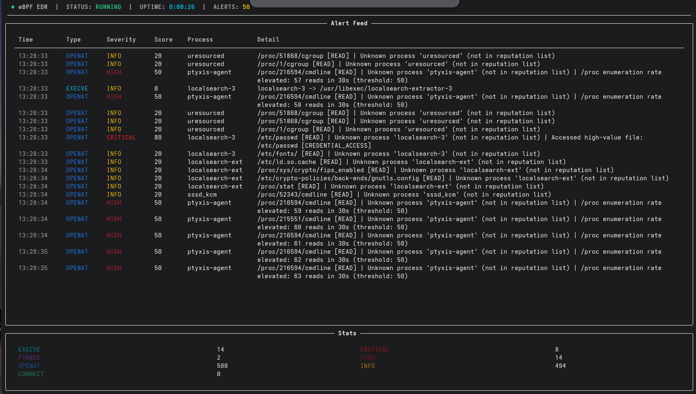

# eBPF EDR

A lightweight Endpoint Detection & Response agent built on eBPF, designed to detect
real attack patterns at the kernel level with minimal performance overhead.

Monitors syscall activity and network connections in real time, correlates events
across multiple detection layers, and surfaces alerts through a live terminal dashboard.

Built as a senior-level portfolio project demonstrating kernel-space instrumentation,
behavioral detection engineering, and production-minded systems design.

---

## Architecture

The EDR is split across two halves, a pattern that mirrors how production tools
like Falco, Cilium, and Datadog's agent work:

```
┌─────────────────────────────────────────────────────────────────┐
│                          KERNEL SPACE                           │
│                                                                 │
│      syscall_monitor.c              network_monitor.c           │
│   ┌──────────────────────┐       ┌──────────────────────┐      │
│   │  execve  tracepoint  │       │  connect tracepoint  │      │
│   │  ptrace  tracepoint  │       │  AF_INET + IPv6      │      │
│   │  openat  tracepoint  │       └──────────┬───────────┘      │
│   └──────────┬───────────┘                  │                  │
│              │        BPF_PERF_OUTPUT        │                  │
└──────────────┼──────────────────────────────┼──────────────────┘
               │                              │
┌──────────────┼──────────────────────────────┼──────────────────┐
│              ▼          USER SPACE           ▼                  │
│         collector.py  (BCC loader + perf buffer consumer)       │
│              │                              │                   │
│              ▼                              ▼                   │
│     anomaly_engine.py            network_analyzer.py            │
│   ┌──────────────────┐         ┌──────────────────────┐        │
│   │ reputation score │         │  beaconing detection │        │
│   │ high-value files │         │  frequency analysis  │        │
│   │ /proc enumeration│         │  sensitive ports     │        │
│   │ sliding window   │         └──────────┬───────────┘        │
│   └──────────┬───────┘                    │                    │
│              └────────────────┬───────────┘                    │
│                               ▼                                │
│                        dashboard/cli.py                        │
│                      (Rich live terminal UI)                   │
└────────────────────────────────────────────────────────────────┘
```

## Detection Capabilities

### Syscall Monitoring

| Detection | Technique | Severity |
|-----------|-----------|----------|
| Execution from `/tmp`, `/dev/shm` | execve tracepoint + path check | HIGH |
| ptrace ATTACH on another process | ptrace tracepoint + op filter | HIGH |
| /proc enumeration (process discovery) | openat sliding window, rate threshold | HIGH-CRITICAL |
| High-value file access (`/etc/shadow`, SSH keys, etc.) | openat path matching | HIGH |
| Suspicious process reputation | comm lookup against tiered list | INFO-HIGH |

### Network Monitoring

| Detection | Technique | Severity |
|-----------|-----------|----------|
| C2 beaconing | (comm, dst\_ip, dst\_port) tuple frequency over 120s window | HIGH |
| High-frequency connections | connection count per 30s sliding window | HIGH |
| Sensitive port access (22, 4444, 9001, etc.) | port lookup against labeled list | HIGH |
| IPv4 and IPv6 coverage | connect tracepoint handles both address families | - |

### Key Design Decisions

**Kernel-side filtering** - the eBPF probes filter and structure events before passing
them to userspace via a perf ring buffer. Only relevant events cross the kernel/user
boundary, keeping CPU overhead low regardless of syscall volume.

**Behavioral scoring** - events are not binary allow/deny. Each event accumulates a
score across multiple dimensions (reputation, file sensitivity, rate) so correlated
activity surfaces at higher severity than isolated events.

**Config-driven thresholds** - all detection thresholds and watchlists live in
`config/rules.yaml`. Tuning the EDR for a new environment requires no code changes.

## Quick Start

### Requirements

- Linux kernel 5.8+ (tested on Fedora 43, kernel 6.18)
- Python 3.8+
- BCC (BPF Compiler Collection)
- Root privileges (eBPF requires `CAP_BPF` or root)

### Install dependencies

```bash
# Fedora
sudo dnf install bcc bcc-tools python3-bcc kernel-devel

# Ubuntu/Debian
sudo apt install bpfcc-tools python3-bpfcc linux-headers-$(uname -r)

# Python dependencies
pip install rich pyyaml
```

### Run

```bash
git clone https://github.com/jspillers10/ebpf-edr
cd ebpf-edr
sudo python3 agent/collector.py
```

### Run attack simulations

In a second terminal while the collector is running:

```bash
# Syscall-based attacks: /tmp execution, ptrace injection, /proc enumeration
sudo python3 tests/attack_sim/syscall_sim.py

# Network-based attacks: beaconing, high-frequency, sensitive ports
python3 tests/attack_sim/exfil_sim.py
```

---

## Project Structure

```
ebpf-edr/
├── probes/
│   ├── syscall_monitor.c     # eBPF: execve, ptrace, openat tracepoints
│   └── network_monitor.c     # eBPF: connect tracepoint (IPv4 + IPv6)
├── agent/
│   ├── collector.py          # BCC loader, perf buffer consumer, event router
│   ├── anomaly_engine.py     # Syscall detection: reputation, files, /proc rate
│   ├── network_analyzer.py   # Network detection: beaconing, frequency, ports
│   └── config_loader.py      # Loads rules.yaml at startup
├── dashboard/
│   └── cli.py                # Rich live terminal UI
├── config/
│   └── rules.yaml            # All tunable thresholds, watchlists, reputation tiers
└── tests/
    └── attack_sim/
        ├── syscall_sim.py    # Simulates /tmp exec, ptrace attach, /proc enumeration
        └── exfil_sim.py      # Simulates C2 beaconing, port scanning, sensitive ports
```

---

## Sample Output

### Dashboard



### Attack Simulation - Syscall

Running `syscall_sim.py` against the live collector produces:

```
[EXECVE] pid=XXXXX ppid=XXXXX uid=1000 | python3 -> /tmp/edr_test_payload.sh
[EXECVE] pid=XXXXX ppid=XXXXX uid=1000 | edr_test_payload -> /usr/bin/whoami
[EXECVE] pid=XXXXX ppid=XXXXX uid=1000 | edr_test_payload -> /usr/bin/id
[EXECVE] pid=XXXXX ppid=XXXXX uid=1000 | edr_test_payload -> /usr/bin/hostname
[PTRACE] HIGH | python3 -> target_pid=XXXXX | op=ATTACH
[OPENAT] HIGH score=50 | python3 -> /proc/XXXXX/status [READ] | /proc enumeration rate elevated: 51 reads in 30s
[OPENAT] HIGH score=70 | python3 -> /proc/XXXXX/status [READ] | /proc enumeration rate CRITICAL: 151 reads in 30s
```

### Attack Simulation - Network

Running `exfil_sim.py` against the live collector produces:

```
[CONNECT] HIGH score=70 | python3 -> 1.1.1.1:4444 | Connection to sensitive port 4444 (METASPLOIT_DEFAULT)
[CONNECT] HIGH score=40 | python3 -> 1.1.1.1:XX | High-frequency connections: 21+ in 30s
[CONNECT] HIGH score=70 | python3 -> 1.1.1.1:22 | Connection to sensitive port 22 (SSH)
[CONNECT] HIGH score=70 | python3 -> 1.1.1.1:23 | Connection to sensitive port 23 (TELNET)
```

---

## Detection Engineering Notes

These are the same behavioral patterns that production EDR tools and threat hunting
teams look for. Each simulation maps to a real TTP:

| Simulation | MITRE ATT&CK TTP |
|------------|-----------------|
| Execution from `/tmp` | T1059 - Command and Scripting Interpreter |
| ptrace ATTACH | T1055.008 - Process Injection: ptrace |
| /proc enumeration | T1057 - Process Discovery |
| C2 beaconing | T1071 - Application Layer Protocol |
| High-frequency port scan | T1046 - Network Service Discovery |
| Sensitive port connection | T1571 - Non-Standard Port |

---

## How It Works - eBPF Primer

eBPF programs run inside the Linux kernel in a sandboxed VM. They attach to
tracepoints and fire on every matching syscall across every process on the system.
No kernel module required, no reboot, minimal overhead.

This project uses **BCC (BPF Compiler Collection)** which compiles C eBPF programs
at runtime and provides a Python API for consuming events from the kernel via a
**perf ring buffer**, a lock-free circular buffer that the kernel writes to and
userspace reads from.

The two halves pattern is deliberate:

- **Kernel side** (`probes/*.c`) - filters and structures raw syscall data into
  fixed-size structs, submits only relevant events. Runs at kernel speed.
- **User side** (`agent/*.py`) - applies behavioral logic, maintains state across
  events (sliding windows, connection trackers), generates scored alerts.

This mirrors how Falco, Cilium, and Datadog's eBPF agent are architected.

---

## License

MIT
